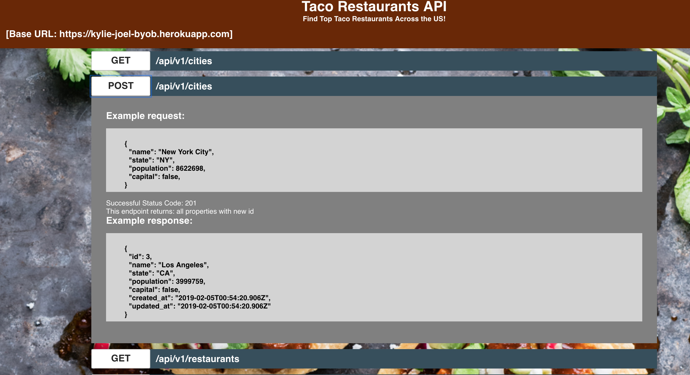

## Tacos-Restaurants API Documentation 

[Visit App Here](https://tacos-restaurants-api-frontend.herokuapp.com/)

### Installation Instructions
- In your terminal complete the following
  - clone down this repo run `git clone https://github.com/mike-duke/byob-frontend.git`
  - cd into the `byob-frontend`
  - `npm install` will install all dependencies required
  - `npm start` application will be live on the following port: `localhost:3000`
  - `npm test` will run test suite

  ### Background 
  For this project we contributed to a public repo created by @JoelSmith @KylieStanley. They created a backend repo with a database storing top rated taco restaurants and the US citiies where they are located. After contributing to issues on the scrum board on thier repo page we pivoted to creating a front-end site where users could find documentation on how to consume their API. 

  ### Project Details
  Using Jest and React.js we delivivered a fast single page appliction fueled by TDD. At the click of the button users are able to see a sample request body, status code for success, and reponse body for any given endpoint available on the server. 

  ### Tech Stack 
  - React
  - Jest
  - Enzyme
  - CSS
  - Heroku
  - TravisCI

  
  

